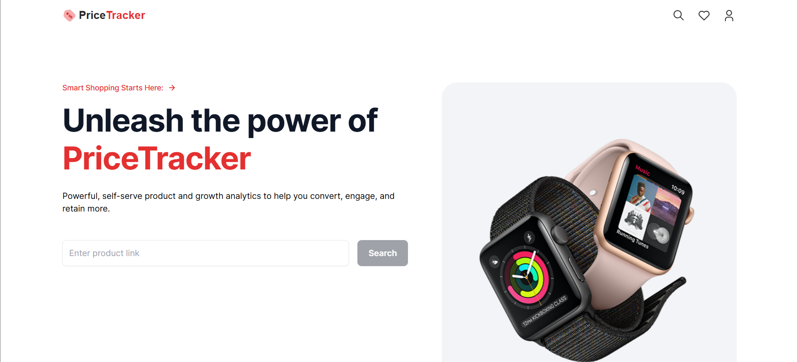

<h1 align="center" id="title"># 🛒 Amazon Price Tracker</h1>

<p align="center"></p>

<p id="description">Track and monitor product prices on Amazon effortlessly! This application notifies users via email whenever the price of their tracked products changes. Hosted on Vercel for seamless deployment.</p>

<h2>Project Screenshots:</h2>



  
  
<h2>🧐 Features</h2>

Here're some of the project's best features:

*   Add Amazon product links to monitor their prices.
*   Get instant updates on price changes.
*   Simple interface to manage your tracked items.
*   Powered by Cron jobs for periodic price checks.

<h2>🛠️ Installation Steps:</h2>

<p>1. Clone the repository:</p>

```
git clone https://github.com/SushantVijay/PriceTracker.git
```

<p>2. Install dependencies:</p>

```
npm install
```

<p>3. Set up environment variables:</p>

```
MONGODB_URI=your_mongodb_connection_string EMAIL_SERVICE=your_email_service EMAIL_USER=your_email_address EMAIL_PASS=your_email_password
```

<p>4. Start the development server:</p>

```
npm run dev
```

<p>5. Open http://localhost:3000 in your browser to use the app.</p>

<h2>🍰 Contribution Guidelines:</h2>

Contributions are welcome! If you have suggestions for improvements or new features feel free to open an issue or submit a pull request.

  
  
<h2>💻 Built with</h2>

Technologies used in the project:

*   Next.js 13 with TypeScript
*   MongoDB
*   Cron Jobs

<h2>💖Like my work?</h2>

If you encounter any issues or need assistance feel free to reach out! I'll try to respond as soon as possible to assist you! 🙂
